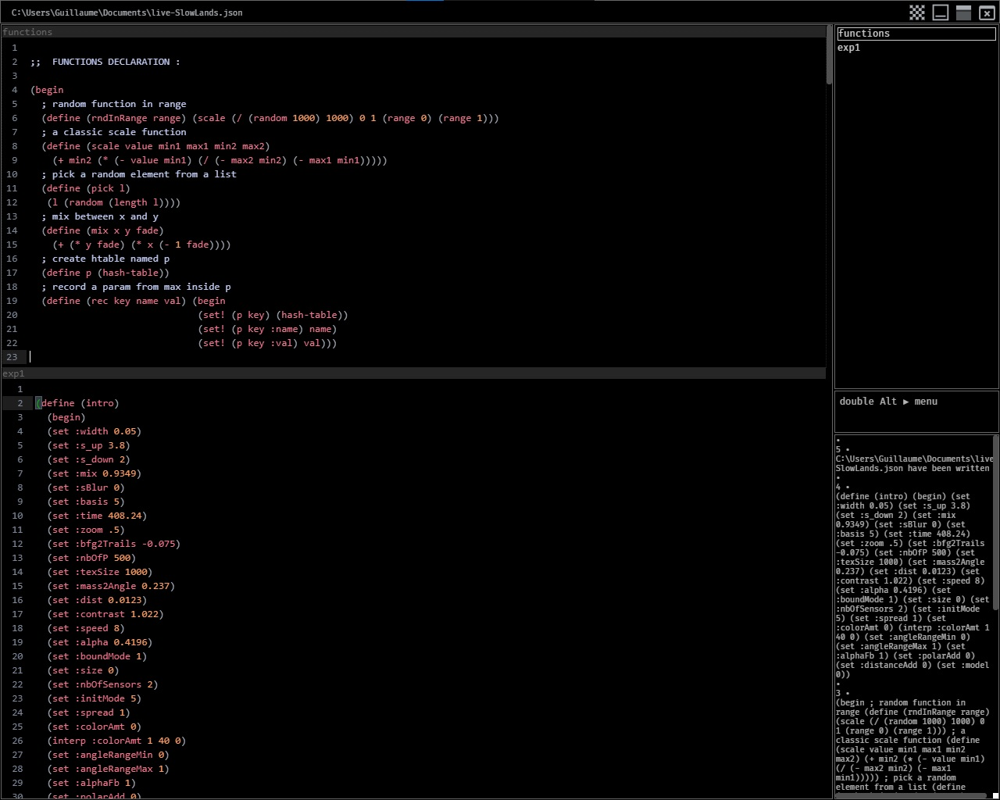

# scheme-editor - v1.0 (Oct 2021)

Scheme-editor, is an open source code editor created with the idea of being used in live coding situations, and in combination with the [Scheme For Max external](https://github.com/iainctduncan/scheme-for-max) made by Iain Duncan.

For the reason that this project is a new born, it should be considered as a Beta Release for the moment and it may change continuously. But however, is already available on Windows, Mac and Linux in the download section.

##### Technologies used for this project :

- [VueJs](https://vuejs.org/)

- [Tauri](https://tauri.studio/en/)

- [CodeMirror 6](https://codemirror.net/6/)

  

##### Features of the v1.0: 

- Multiples editors in the same window

- Save/load sessions (json files)

- Eval scheme expression, and send it to max via websocket

- Create custom snippets with placeholders directly in the editor

- Create custom shortcuts directly in the editor

- Transparent background

- Jump to the next/previous expression via Ctrl-ArrowUp/arrowDown

  

### Documentation :

##### 1/ The interface:

### 
​	On the top different infos and buttons are shown, on the left side, the path of the current file, on the right we can see four buttons related to 		transparency, minimize window, maximize window and quit.	

	Bellow that, left panel is the main section dedicated to editors, they are displayed vertically. Press Tab or shift-Tab to jump to the next/previous editor.
	
	On the right from the top we have an info panel where we can see all editor's name in the file. By clicking on them we can hide (or ctrl+click to show) 	editors.

	On the middle we have the menu, really inspired by the [spacemacs](https://www.spacemacs.org/) menu for those who knows. 
	The idea of this menu is to be able to quickly execute a command without having to use the mouse. 
	To enter in the menu just press quickly alt twice. 
	Then the menu is proposing you choices, press "f" to go in the file menu, or "e" for the editor menu etc. 
	To escape the menu you can just press a random key or escape.

	And finally on the bottom we have the editor console, where are shown commands when they are executed, errors and stuff.  


##### 2/ Evaluation:


	To send an expression you just have to put the cursor inside it and press Ctrl-e.

	⚠ To make the parsing around the cursor the most efficient possible you have to respect this rule :

	Any line that begins with an open parenthesis followed by a character is taken to be the beginning of a top-level expression.

 	see [here](https://github.com/oakmac/atom-parinfer/blob/master/images/zwei-top-level-expression-hack.png?fbclid=IwAR3GFYbsvCF4pot5nkmmptm3DO_fPVgWPWRdllLnFKocw3Jyu5FA5PIYqis) for more informations.


##### 3/ Snippets:


	Creating a snippet is really simple. First you have to surround your expression by two specific comments :

	;%s my-snippet-name at the top

	;%end at the bottom

	Then by using the menu (double alt > p > s) you will record all snippets. 
	Snippets can have place holders by using #{placeholders}, jump to the next placeholders by pressing Tab.

	example: 

	```scheme
	;%s my-post
	(define #{name}
	 (post #{something}))
	;%end

	```


##### 3/ Hotkeys:


	Attaching a shortcut to an expression is almost like creating a snippet. First you have to surround your expression by two specific comments :

	;%k Mod-Alt-K at the top (Mod is for Ctrl/Cmd) 

	;%end at the bottom

	Then by using the menu (double alt > p > h) you will record all shortcuts. 

	example: 

	```scheme
	;%s Mod-l
	(post '(1 2 3))
	;%end

	```

